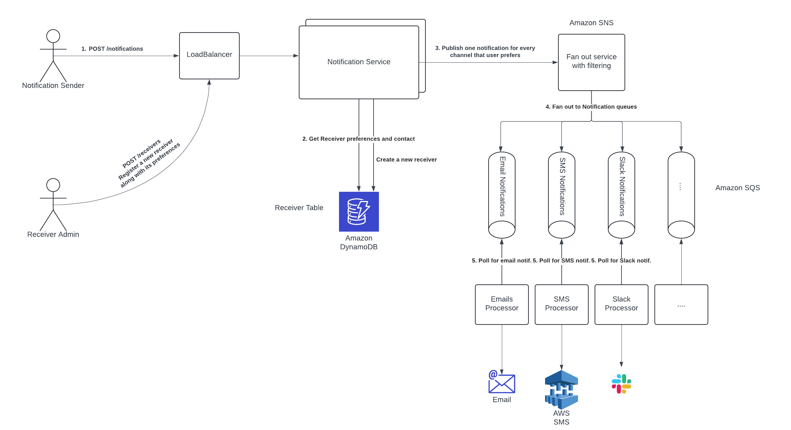
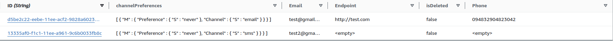

# General Architecture



The architecture above should be able to satisfy all of the requirements for the task which are:
1. The system needs to be able to send notifications via several different channels (email,
sms, slack) and be easily extensible to support more channels in the future.
2. The system needs to be horizontally scalable.
3. The system must guarantee an "at least once" SLA for sending the message

Let's start with explaining the solution and at the end I will provide an analisys how are these requirements satisfied. 

### DB Model

The only DB model that I identified that would be needed would be the contact data of a particular receiver along with its preferences for channels. Given our minimal data footprint I decided Amazon DynamoDB to be an adequate choice for a data store, because it is highly scalable and its semantics of a Key-Value store are enough in this case. 
Here is how this table looks like:


Futhermore since we want our channels to be as flexible as possible the fact that DynamoDB is NoSQL provides us with a lot of flexible in the future to extend this database design with further channels.

The main idea with the channel preferences field is that when a notification writer sends a notification the notification would be sent by default to all available channels. Only the channels that the receiver has opted out of would be excluded. In the picture above for example a notification to the first receiver would be sent only to the SMS and Slack channels since the receiver has set a preference of "never" to the "email" channel.

### Notification Service

This is the main interface for interaction with the notification system.
The reason behind my decision of it being a separate service is that typically we want this API to be easily interchangable and to be scalable on its own. It has different concerns and needs from the other services in the system.

Additionally, a Load Balancer would be extremely beneficial in regulating the traffic to this API. The Load Balancer could employ a Consistent Hashing algorithm along with a coordination service in order to send notification for the same receiver to the same notification-service nodes, but then we would have a problem for really popular receivers. Because of that I think that a simple Round Robin Load Balancer should be sufficient for this solution.

It is a simple HTTP Server written in Golang and it provides three endpoints for this MVP:
* POST /notifications - Send a notification to a given receiver.
```
{
    "receiverID": "d5be2c22-eebe-11ee-acf2-9828a60234dc",
    "message": "Hello"
}
```
* POST /receivers - Register a new receiver that can accept notifications. Upon success return the created receiver along with its ID
```
{
    "email": "test@gmail.com",
    "phone": "+124243254",
    "endpoint": "http://slack.com",
    "channelPreferences": [
        {
            "channel": "sms",
            "preference": "never"
        },
        {
            "channel": "slack",
            "preference": "never,
        }
    ]
}
```
* GET /receivers/{receiverID} - Retrieves a receiver corresponding to the provided as a path parameter along with all of its data.

The two receiver endpoints and pretty straightforward so I won't be explaining them. They are simple CRUD operations with much business logic. 

The notification endpoint is more interesting and contains a bit more business logic. Upon handling a request on the notifications endpoint a call to the DB is made to retrieve the receiver corresponding the the receiver ID from the body. The notification service needs the receiver in order to determine the contacts of this receiver and also its preferences. Here in case it was a production environment I would use an in-memory cache to store the receivers and try to get it from there. This cache could be refreshed every 1 minute or so. The reason for that is that I do not expect a lot of overrides of the receiver information and in case there is, I think that it would be acceptable for the system to be eventually consistent in that regard. 

Once we have retrieved the receiver along with its preferences the channels that the receiver has opted out of are filtered out from the message. For every channel that is left after the filtration, a clone of the initial message is made, but only for that channel. 

After that all of the duplicated messages are published to Amazon SNS, which acts as our fan-out service.

### Fan-out service

The fan-out service receives all of the notifications and sends them to various places according to some configuration. Ultimately I could have written this myself, but in my opinion AWS SNS gives all of the needed functionality and most importantly the filtering mechanism. In AWS SNS I have defined filter policies based on the specified channel in every notification, and according to it SNS selects which notification processing queue to select and send the notification to. 

There are two main benefits of using a fan-out service instead of publishing the messages ourselves to the notification queues. 
* The complexity of our system stays realtively low and the code for maintaining is a lot less. We do not have to keep track of some configuration of which queue corresponds to which channel and their URL, states, etc. We simply publish to the queue and forget about the notification.
* Addition/Removal of notification queues is extremely easy, thus allowing the easy extension of new channels. The only thing that needs to be done for a new channel is to provision a new queue and subscribe to the Fan-out service (AWS SNS)

### Notification processing

In this design the Fan-out service published the notification according to a filter policy to AWS SQS queue for processing of notifications. The reason why I decided to use a queue for this part of the design is, because we have to be extremely careful in not overloading our notification processor services. External services for email, sms and slack notification could be slow or need more processing at a particular time. Queues allow the system to buffer in such cases and allow the processors to take notifications only in case they would be able to process them, thus we are able to control the rate of processing on a more granular level. 

Additionally the notification queues allow our code to stay lean and easy to maintain, because the notification-processor service is a set of goroutines that polls from the queue and acts accordingly based on the channel in the message.

# Requirements analisys

1. The system needs to be able to send notifications via several different channels (email,
sms, slack) and be easily extensible to support more channels in the future.

I would say that this requirement is satisfied. The process of adding an additional channel would be to simply provision a new AWS SQS queue and provisioning new replicas of the notification-processor that is configured to poll against that queue. Obviously, the logic for handling the message and actually sending it the corresponding channel still needs to be written, but that has been abstracted away as much as possible through the use of the Composition Design Pattern in `notification-processor/internal/sqsclient/consumer.go`

From the receiver side whenever a new notification is sent it would be automatically sent to the new channel as long as the receiver has not opted out of it.

2. The system needs to be horizontally scalable.

Every aspect of the system is horizontally and vertically scalable. The API can be scaled according to the needs of the API (the main pain point there would be the notification endpoint) and for the notification processors we can scale them even on a more granular level on a channel basis. In case one channel is getting more traffic than others it can be autoscaled with a kubernetes HPA without us even notificing.

3. The system must guarantee an "at least once" SLA for sending the message

The system guarantees an "at least once" SLA, because we should not be able to experience a partial failure in our system that is not idempotent. What I mean by that is that thorough the whole system if a partial failure occurrs the operation can be simply retried and the result would be the same. The Notification-Service returns a 200 status code only in case it was able to successfully publish the notification to AWS SNS. AWS SQS provides a guarantee of "at least once": https://docs.aws.amazon.com/AWSSimpleQueueService/latest/SQSDeveloperGuide/standard-queues-at-least-once-delivery.html.

In the notification processors we also cannot experience a partial failure and lose the notification, because of the way how AWS SQS works. Basically whenever a processor polls a notification from SQS, this message is excluded for a given period from further polling from other processors (for example 30 seconds). In case the notification processor does not delete the message from SQS before the period ends (for example it crashed after it polled the notification and was not able to finish its work), SQS will automatically put the notification at the top of queue once this period ends and simply the next notification processor will handle it.

# Demo

The commands that can be used to run the system are:
`API_PORT=8081 TABLE_NAME="notification-receivers" SNS_TOPIC="topic_arn" go run ./cmd/notification-service/`
`QUEUE_URL="queue_url" WORKERS=10 POLL_DELAY=10 go run ./cmd/notification-processor/`

Despite that there is a bunch of configuration on AWS side that needs to be done in order to actually run the application, so if that is something that you are interested in, please contact me.


https://github.com/HristianIliev/sumup-task/assets/18559816/bb38c401-5129-44b7-9eca-4be1c11aba85


### Main implementation details that were left out

I wanted to finish this design description with a note that the solution that is displayed here is definetely not production ready and needs a bit more work
in order to hash out the semantic details. Some of the details that I did not have time to finish are:

* Cost Analisys

I think that a natural next step for this project would be to try and estimate how much does this system design cost for a month.

* Error handling

Both in the notification-service and in the notification-processor the error handling is subpar. The reason for that is, because I did not have time to create
sufficient abstractions for error handling and what to do with the different kinds of errors. For example in the notification-service I am directly returning
the possible errors in the response to the customer. Ideally I would have written an error type that had a notion of which HTTP Status code it maps to and also
has a mapping to the customer visible error message that would be ideally set by the Product Owner or someone more customer oriented.

* Logging

While logging is an integral part of every application I have simply used the native log library from golang.

* API Validations

The way I understand the task assignment is that the focus is more on the architecture that I choose and how I structure my modules instead of semantics and
small implementation details like validating whether the incoming json body of the request is in the format that we require. This logic is trivial, but nonetheless
time-consuming so I have decided to not implement it at all.

* Actual sending of the notifications

Once the notification-processors have polled the fanned-out notifications from SQS and have routed to the correct subscriber the actual logic for sending a notification
to the customer can be executed. I.E actually sending the Email through some kind of an Email server, or actually sending the SMS to the Phone. I have not implemented
due to the same reason as above. I thought that this is not the main focus of the task.

* Endpoint for updates of preferences of receiver

Good to have, but out of scope
